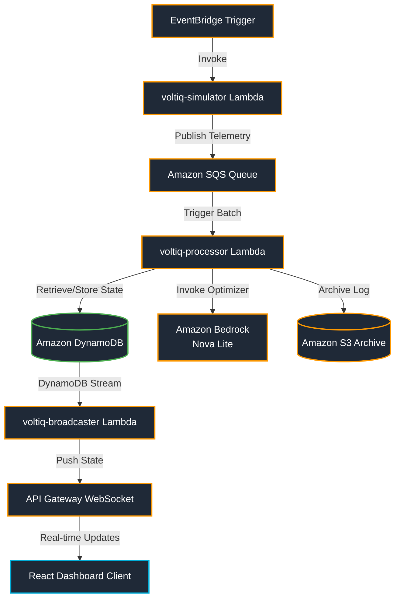

# VoltIQ

VoltIQ is a real-time charging optimization engine for electric vehicle (EV) fleets in Lagos, Nigeria. The platform monitors battery states, route schedules, and GPS coordinates to dynamically shift vehicle charging to off-peak grid hours, saving up to **₦5,184 per charge cycle** per vehicle.

## Key Features
- **Real-Time Telemetry**: Deployed on AWS SQS and Lambda (Go) for handling high-frequency vehicle battery and GPS updates.
- **AI-Driven Charge Optimization**: Integrates with Amazon Bedrock (Nova Lite) to analyze grid pricing and recommend charging schedules.
- **Live Updates**: Uses DynamoDB Streams and API Gateway WebSockets to push state updates instantly to the frontend dashboard.
- **Tariff Engine**: Built-in support for Nigeria's hourly grid tariffs.

---

## Architecture

The system uses a serverless, event-driven architecture on AWS:



- **voltiq-simulator**: Simulates GPS tracks and battery drainage for 5 test vehicles navigating Lagos, writing coordinates and state to SQS.
- **voltiq-processor**: Consumes telemetry, retrieves nearest charging stations, calls Bedrock for optimization scheduling, calculates actual cost/savings, and writes the latest state to DynamoDB.
- **voltiq-broadcaster**: Reacts to DynamoDB streams on state updates and broadcasts the payload to active browser connections over WebSockets.

---

## Lagos Grid Tariff Tiers (WAT / UTC+1)

VoltIQ calculates savings dynamically using hourly pricing tiers in Nigeria:

| Tariff Tier | Hours (WAT) | Rate (NGN/kWh) | Strategy |
| :--- | :--- | :--- | :--- |
| **Off-Peak** | 23:00 – 05:59 | **₦185** | Maximize charging (cheapest rate) |
| **Shoulder** | 06:00 – 17:59 | **₦225** | Charge only if battery is critical |
| **Peak** | 18:00 – 22:59 | **₦320** | Avoid charging (grid stress period) |

---

## Local Setup & Deployment

### 1. Local Code Validation
Ensure Go is installed locally:
```bash
# Tidy modules and verify dependencies
go mod tidy

# Verify code compiles cleanly
go build ./...

# Run static checks
go vet ./...
```

### 2. Deploying to AWS
Run the shell scripts in `scripts/` to seed database tables and build/deploy Lambda zip bundles:
```bash
# Seed Lagos charging stations
./scripts/seed_stations.sh

# Pre-seed savings metrics for the demo dashboard
./scripts/seed_savings.sh

# Cross-compile for linux/arm64 and upload functions to Lambda
./scripts/redeploy_all.sh
```

---

## Environment Variables

Each Lambda expects the following environment variables to be set:

* **voltiq-simulator**:
  - `SQS_QUEUE_URL`: Target telemetry SQS queue URL.
  - `DYNAMO_REGION`: AWS region for fetching current state (default: `af-south-1`).
* **voltiq-processor**:
  - `DYNAMO_REGION`: AWS region for storing vehicle states (default: `af-south-1`).
  - `BEDROCK_REGION`: AWS region for Bedrock (default: `us-east-1`).
  - `S3_BUCKET`: Name of S3 bucket for raw telemetry archiving.
* **voltiq-broadcaster**:
  - `APIGW_ENDPOINT`: WebSocket API Gateway connection callback URL.
  - `DYNAMO_REGION`: AWS region (default: `af-south-1`).

