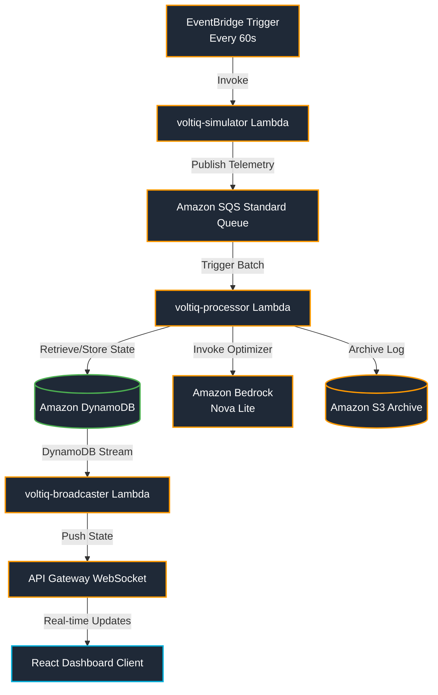

# ⚡ VoltIQ

<p align="center">
  
  
  
  
</p>

---

## 📋 Project Overview

VoltIQ is a real-time charging optimization engine designed for commercial electric vehicle (EV) fleets in Nigeria. The platform continuously monitors battery levels, schedules, and route ranges to dynamically shift charging loads to off-peak periods, saving up to **₦5,184 per vehicle charge cycle** based on Nigeria's three-tier grid pricing.

*   **⚡ Decentralized Telemetry Pipeline**: Built on Go and powered by AWS SQS and Lambda functions.
*   **🤖 AI Charge Optimizer**: Integrates with Amazon Bedrock (Nova Lite) to analyze grid tariffs and fleet requirements.
*   **📊 Live WebSocket Dashboard**: Pushes updates to a React dashboard for real-time fleet state tracking.

---

## 🏗️ System Architecture



### Infrastructure Core

| Service | Purpose |
| :--- | :--- |
| **Amazon SQS** | Ingestion queue for high-frequency telemetry events |
| **AWS Lambda** | Event-driven processors cross-compiled for `linux/arm64` (Graviton2) |
| **Amazon Bedrock** | Serverless LLM execution layer hosting the **Amazon Nova Lite** model |
| **Amazon DynamoDB** | Persistent storage for vehicle states, active sessions, and charging stations |
| **Amazon S3** | Durable storage bucket archiving raw telemetry events for auditing |
| **Amazon API Gateway** | WebSocket server routing message broadcasts to active clients |
| **Amazon EventBridge** | Serverless scheduler driving the fleet simulation loop |

---

## 📁 Repository Structure

```
📂 VoltIQ/
├── 📄 README.md                 # Project quick-start and infrastructure overview
├── 📄 walkthrough.md            # In-depth architectural review of code files
├── 📄 industry_features.md       # Real-world EV enterprise roadmap
├── 📄 dashboard.html            # Local WebSocket testing client
├── 📁 cmd/
│   ├── 📁 simulator/
│   │   └── 📄 main.go           # Lambda #1: Battery drainage & GPS telemetry simulator
│   ├── 📁 processor/
│   │   └── 📄 main.go           # Lambda #2: AI Bedrock decision and pricing logic
│   └── 📁 broadcaster/
│       └── 📄 main.go           # Lambda #3: DynamoDB Stream WebSocket pusher
├── 📁 internal/
│   ├── 📁 models/
│   │   └── 📄 models.go         # Shared API JSON contracts and database schemas
│   ├── 📁 bedrock/
│   │   └── 📄 client.go         # Amazon Bedrock Nova Lite wrapper and parser
│   ├── 📁 dynamo/
│   │   └── 📄 client.go         # DynamoDB CRUD helpers
│   ├── 📁 sqs/
│   │   └── 📄 producer.go       # SQS telemetry message publisher
│   └── 📁 pricing/
│       └── 📄 grid.go           # West African Time (WAT) electricity tariff engine
└── 📁 scripts/
    ├── 📄 redeploy_all.sh       # Script: Compiles and deploys Go binaries to AWS
    ├── 📄 seed_stations.sh      # Script: Seeds the 5 Lagos charging stations into DynamoDB
    └── 📄 seed_savings.sh       # Script: Pre-seeds historical saving statistics for demo
```

---

## 🇳🇬 Lagos Grid Tariff Tiers

VoltIQ's pricing engine dynamically calculates rates based on **West Africa Time (WAT = UTC+1)**:

| Period | Hours (WAT) | Rate (NGN/kWh) | Optimization Strategy |
| :--- | :--- | :--- | :--- |
| **Off-Peak** | 23:00 – 05:59 | **₦185** | 🔋 Recommended window (Maximum charge rate) |
| **Shoulder** | 06:00 – 17:59 | **₦225** | ⏳ Normal load (Charge only if battery is critical) |
| **Peak** | 18:00 – 22:59 | **₦320** | ⚠️ Avoid window (High tariff load period) |

---

## 🛠️ Deploying & Running the System

### Local Build Validation
```bash
# Clean and verify local dependencies
go mod tidy

# Test compilation of Go packages
go build ./...

# Run code validation
go vet ./...
```

### Cloud Deployment
```bash
# 1. Seed Lagos Charging Stations
chmod +x scripts/seed_stations.sh
./scripts/seed_stations.sh

# 2. Pre-seed Savings History for Demo Day
chmod +x scripts/seed_savings.sh
./scripts/seed_savings.sh

# 3. Build & Update Lambda Binaries
chmod +x scripts/redeploy_all.sh
./scripts/redeploy_all.sh
```

---

## 🛡️ IAM Permissions Matrix

| Lambda Function | Required Actions / Resources |
| :--- | :--- |
| **`voltiq-simulator`** | ◽ `sqs:SendMessage` on `voltiq-telemetry` queue |
| **`voltiq-processor`** | ◽ `dynamodb:GetItem`, `PutItem` on `VehicleState` & `ChargingStations`<br>◽ `s3:PutObject` on telemetry archive bucket<br>◽ `bedrock:InvokeModel` on `amazon.nova-lite-v1:0` model ARN<br>◽ `sqs:ReceiveMessage`, `DeleteMessage` on queue |
| **`voltiq-broadcaster`** | ◽ `dynamodb:Scan`, `DeleteItem` on `Connections`<br>◽ `dynamodb:GetRecords` on `VehicleState` stream ARN<br>◽ `execute-api:ManageConnections` on API Gateway |

---

## 🏆 Presentation Script (4-Minute Demo)

| Timeline | Action | Showcase Focus |
| :--- | :--- | :--- |
| **0:00 – 0:45** | **Core Concept** | Pitch VoltIQ as the financial margin protection layer for Lagos EV fleets. |
| **0:45 – 1:30** | **Live Telemetry** | Show the live React dashboard mapping 5 active e-buses navigating Lagos. |
| **1:30 – 2:15** | **AI Decision** | Show vehicle **VQ-003** dropping to 18% battery. Watch the real-time AI decision card update to `CHARGE_LATER`. |
| **2:15 – 3:00** | **Tariff Savings** | Explain the AI reasoning: waiting until 23:00 Off-Peak saves ₦5,184 on this single charge. |
| **3:00 – 4:00** | **AWS Architecture** | Explain the serverless Go pipeline: SQS → Bedrock Nova Lite → DynamoDB Streams → WebSockets. |

---

*Developed by Team VoltIQ for the Arthurite Integrated ONE WITH AI Summit 2026.*
