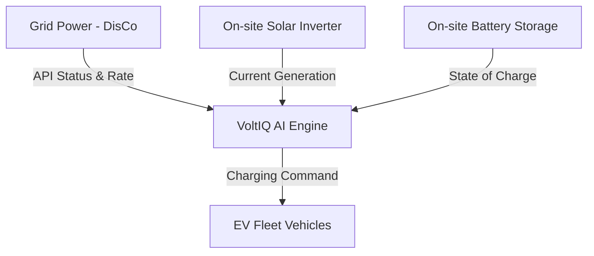

# VoltIQ — Real-World Enterprise Roadmap & Deep Industry Research
### Moving from a Hackathon Demo to a Commercial Production Platform
**Author:** Antigravity AI (Tech Lead & Product Manager)

---

## 1. The Real-World Reality of Lagos Charging & Grid Infrastructure
To scale VoltIQ from a 5-vehicle demo to a commercial system optimizing hundreds of e-buses and delivery vans in Lagos, we have to deal with constraints that don't exist in a pure simulator:
1. **Grid Instability (Grid vs. Off-Grid)**: Lagos operates on a hybrid grid system. Fleets rely on Ikeja Electric (IE) or Eko Disco (EKEDP) when the grid is up, but immediately switch to industrial diesel generators or commercial solar microgrids during blackouts.
2. **Dynamic Pricing & Load Shedding**: Grid tariffs are structured (Band A users pay premium rates for guaranteed 20+ hours), but real-time load shedding means power can cut out unpredictably.
3. **Battery Asset Depreciation**: A single electric bus battery pack costs $15,000–$25,000. Bad charging habits (constant fast-charging, holding charge at 100% in high heat) can degrade a battery's lifetime in 3 years instead of 8.

---

## 2. Top 4 Critical Production Features for VoltIQ

### 1. Dynamic Grid Load & Hybrid Source Orchestration (VPP Integration)
In the real world, the AI cannot assume grid power is always available or that the rate is the only variable.
* **How it works in production**: The system connects via APIs to the local DisCo (e.g., Ikeja Electric API) and the fleet site's local energy management system (solar inverter + stationary storage batteries).
* **The AI's job**: Decide whether to charge using **Grid Power** (when cheap/stable), **Solar PV** (during peak daylight), **Stationary Battery Storage** (peak shaving), or delay charging.
* **Why it matters**: Charging an electric fleet from a diesel generator during a blackout cancels out the environmental benefits and triples the cost per kWh.

### 2. Battery State of Health (SoH) & Smart Degradation Prevention
Charging at 100kW DC is fast but heats the battery, causing faster degradation compared to 22kW AC.
* **How it works in production**: The telemetry events ingest battery temperature, cell voltage variance, and current State of Health (SoH %).
* **The AI's job**: Compare the vehicle's dwell time (how long it will stay parked) against the charging rate. If a vehicle has 8 hours before its next trip, the AI throttles the charger to slow AC charging (22kW) to preserve battery health. If the dwell time is only 30 minutes, it calls for high-power DC fast charging.
* **Why it matters**: Saves fleet operators tens of thousands of dollars in premature battery replacement costs.

### 3. Dispatch & Telematics Route Integration
Next trips are rarely static. Traffic on the Third Mainland Bridge, heavy payloads, and air conditioning load radically change how many kWh a trip actually consumes.
* **How it works in production**: VoltIQ integrates directly with fleet management APIs (like Geotab, Samsara) and scheduling software.
* **The AI's job**: Pull the exact passenger/cargo payload weight, route elevation, weather (heat index), and real-time Google Maps traffic data for the scheduled route. It calculates the exact dynamic SoC buffer required (e.g., "This route needs 38% battery, not 30%").
* **Why it matters**: Prevents the absolute worst-case scenario: a vehicle running out of charge on a high-speed expressway in the middle of Lagos.

### 4. Automated Charging Protocols (OCPP & ISO 15118)
In our hackathon pipeline, the AI decides to "CHARGE_NOW" and we display it. In production, this decision must execute automatically at the physical charger.
* **OCPP 2.0.1 (Open Charge Point Protocol)**: The industry standard for letting the cloud start/stop charging, set maximum power limits (Smart Charging), and monitor active power draw.
* **ISO 15118 (Plug & Charge)**: Cryptographic handshake where the bus is plugged in, authenticates itself, and begins charging without needing an RFID card or mobile app.
* **Web3 Micropayments**: Automatically paying for the exact kWh consumed using eNaira or stablecoins directly from the vehicle's built-in wallet to the charger, minimizing transaction fee overheads.

---

## 3. Recommended Tech Stack Additions for Production

| Component | Hackathon MVP | Production Target |
|---|---|---|
| **AI Model** | Amazon Bedrock (Nova Lite) | **Fine-Tuned Llama 3.1 / Nova** (Trained on battery thermodynamics & tariff schedules) |
| **Telemetry Bus** | SQS (Standard) | **AWS IoT Core** (MQTT broker with keep-alive, TLS client certificates on vehicles) |
| **Database** | DynamoDB (Simple States) | **TimescaleDB / Amazon Timestream** (Time-series data for telemetry history + DynamoDB for active states) |
| **Charger Control** | None (Visual only) | **Steve / OpenOCPP Gateway** (Translates cloud JSON into OCPP messages to physical chargers) |
